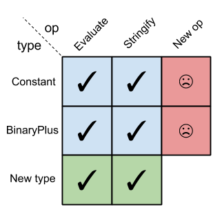
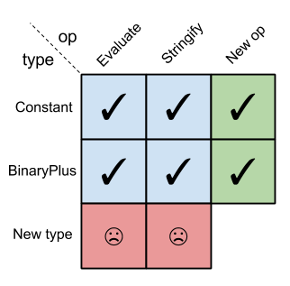

# eli.thegreenplace [The Expression Problem and its solutions](https://eli.thegreenplace.net/2016/the-expression-problem-and-its-solutions/)

The craft(技巧) of programming is almost universally concerned with different types of data and operations/algorithms that act on this data [[1\]](https://eli.thegreenplace.net/2016/the-expression-problem-and-its-solutions/#id7). Therefore, it's hardly surprising that designing **abstractions** for data types and operations has been on the mind of software engineers and programming-language designers since... forever.

## Problem statement

> NOTE: 问题描述: 
>
> 1 添加new type
>
> 2 添加new operation
>
> 3 without changing existing code

Here is a quick **problem statement**.

Imagine that we have a set of **data types** and a set of **operations** that act on these types. Sometimes we need to add more **operations** and make sure they work properly on all types; sometimes we need to add more **types** and make sure all operations work properly on them. Sometimes, however, we need to add both - and herein lies the problem. Most of the mainstream programming languages don't provide good tools to **add both new types and new operations to an existing system without having to change existing code**. This is called the "**expression problem**". Studying the problem and its possible solutions gives great insight into the fundamental differences between **object-oriented** and **functional programming** and well as concepts like **interfaces** and **multiple dispatch**.

## A motivating example

As is my wont, my example comes from the world of compilers and interpreters. 

Imagine we're designing a simple expression evaluator. Following the standard [interpreter design pattern](http://eli.thegreenplace.net/2016/on-the-composite-and-interpreter-design-patterns), we have a tree structure consisting of expressions, with some operations we can do on such trees. In C++ we'd have an interface every node in the expression tree would have to implement:

### `class Expr`

```C++
#include <string>
class Expr
{
public:
	virtual std::string ToString() const = 0;
	virtual double Eval() const = 0;
};

```

This interface shows that we currently have two operations we can do on expression trees - evaluate them and query for their string representations. A typical leaf node expression:

### `class Constant`

```C++
class Constant: public Expr
{
public:
	Constant(double value) :
					value_(value)
	{
	}

	std::string ToString() const
	{
		std::ostringstream ss;
		ss << value_;
		return ss.str();
	}

	double Eval() const
	{
		return value_;
	}

private:
	double value_;
};

```

And a typical composite expression:

### `class BinaryPlus`

```C++
class BinaryPlus: public Expr
{
public:
	BinaryPlus(const Expr &lhs, const Expr &rhs) :
					lhs_(lhs), rhs_(rhs)
	{
	}

	std::string ToString() const
	{
		return lhs_.ToString() + " + " + rhs_.ToString();
	}

	double Eval() const
	{
		return lhs_.Eval() + rhs_.Eval();
	}

private:
	const Expr &lhs_;
	const Expr &rhs_;
};
```

Until now, it's all fairly basic stuff. How extensible is this design? Let's see... if we want to add new expression types ("variable reference", "function call" etc.), that's pretty easy. We just define additional classes inheriting from `Expr` and implement the `Expr` interface (`ToString` and `Eval`).

### Adding new operations

However, what happens if we want to add new *operations* that can be applied to **expression trees**? Right now we have `Eval` and `ToString`, but we may want additional operations like "type check" or "serialize" or "compile to machine code" or whatever.

It turns out that adding new operations isn't as easy as adding new types. We'd have to change the `Expr` interface, and consequently change every existing expression type to support the new method(s). If we don't control the original code or it's hard to change it for other reasons, we're in trouble.

### Expression problem in OOP 

In other words, we'd have to violate the venerable(珍贵的) *open-closed principle*, one of the [main principles of object-oriented design](https://en.wikipedia.org/wiki/SOLID_(object-oriented_design)), defined as:

> software entities (classes, modules, functions, etc.) should be open for extension, but closed for modification

The problem we're hitting here is called the *expression problem*, and the example above shows how it applies to object-oriented programming.

Interestingly, the expression problem bites(咬伤) **functional programming** languages as well. Let's see how.

## The expression problem in functional programming

**Update 2018-02-05:** [a new post](http://eli.thegreenplace.net/2018/more-thoughts-on-the-expression-problem-in-haskell/) discusses the problem and its solutions in Haskell in more depth.

### OOP VS FP

Object-oriented approaches tend to collect functionality in **objects** (types). Functional languages cut the cake from a different angle, usually preferring types as thin data containers, collecting most functionality in **functions** (operations) that act upon them. Functional languages don't escape the expression problem - it just manifests there in a different way.

> NOTE: 上面这一段描述了OOP 和 FP之间的差异

To demonstrate this, let's see how the expression evaluator / stringifier looks in Haskell. Haskell is a good poster child for functional programming since its pattern matching on types makes such code especially succinct:

```haskell
module Expressions where

data Expr = Constant Double
          | BinaryPlus Expr Expr

stringify :: Expr -> String
stringify (Constant c) = show c
stringify (BinaryPlus lhs rhs) = stringify lhs
                                ++ " + "
                                ++ stringify rhs

evaluate :: Expr -> Double
evaluate (Constant c) = c
evaluate (BinaryPlus lhs rhs) = evaluate lhs + evaluate rhs
```

### Adding new operations

Now let's say we want to add a **new operation** - type checking. We simply have to add a new function `typecheck` and define how it behaves for all known kinds of expressions. No need to modify existing code.

### Add a new type 

On the other hand, if we want to add a **new type** (like "function call"), we get into trouble. We now have to modify all existing functions to handle this new type. So we hit exactly the same problem, albeit(尽管) from a different angle.

## The expression problem matrix

A visual representation of the **expression problem** can be helpful to appreciate how it applies to OOP and FP in different ways, and how a potential solution would look.

The following 2-D table (a "matrix") has types in its rows and operations in its columns. A matrix cell `row, col` is checked when the operation `col` is implemented for type `row`:


In object-oriented languages, it's easy to add new types but difficult to add new operations:




Whereas in functional languages, it's easy to add new operations but difficult to add new types:



## A historical perspective

The expression problem isn't new, and has likely been with us since the early days; it pops its head as soon as programs reach some not-too-high level of complexity.

It's fairly certain that the name *expression problem* comes from [an email](http://homepages.inf.ed.ac.uk/wadler/papers/expression/expression.txt) sent by [Philip Wadler](https://en.wikipedia.org/wiki/Philip_Wadler) to a mailing list deailing with adding generics to Java (this was back in the 1990s).

In that email, Wadler points to the paper ["Synthesizing Object-Oriented and Functional Design to Promote Re-Use"](https://cs.brown.edu/~sk/Publications/Papers/Published/kff-synth-fp-oo/) by Krishnamurthi, Felleisen and Friedman as an earlier work describing the problem and proposed solutions. This is a great paper and I highly recommend reading it. Krishnamurthi et.al., in their references, point to papers from as early as 1975 describing variations of the problem in Algol.